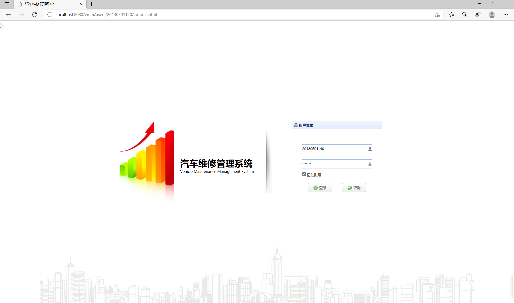
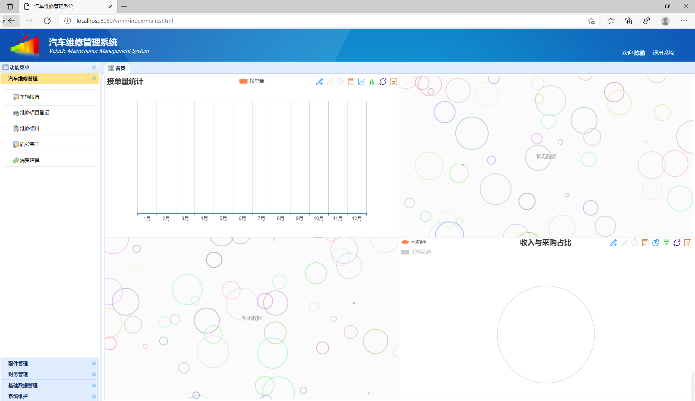
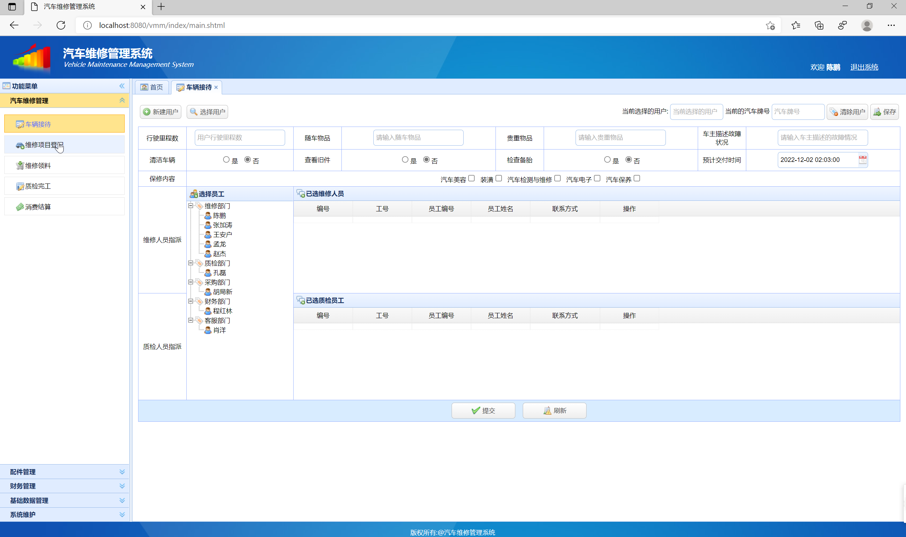
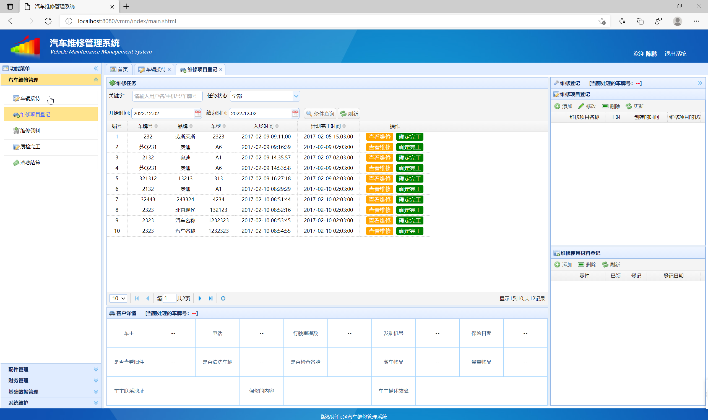
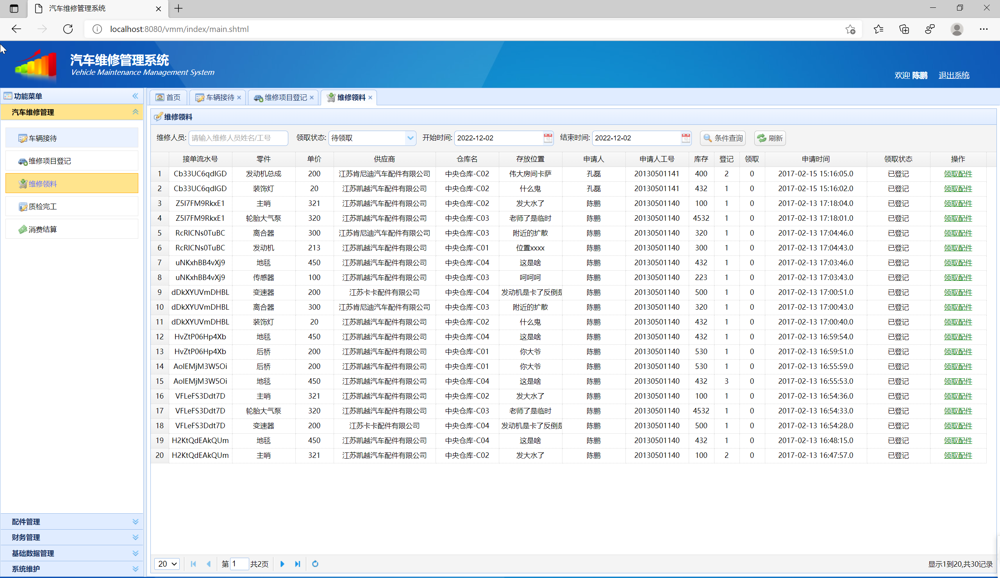
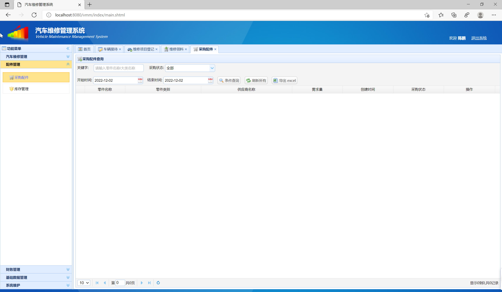
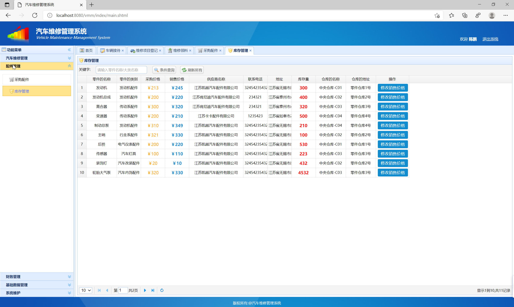
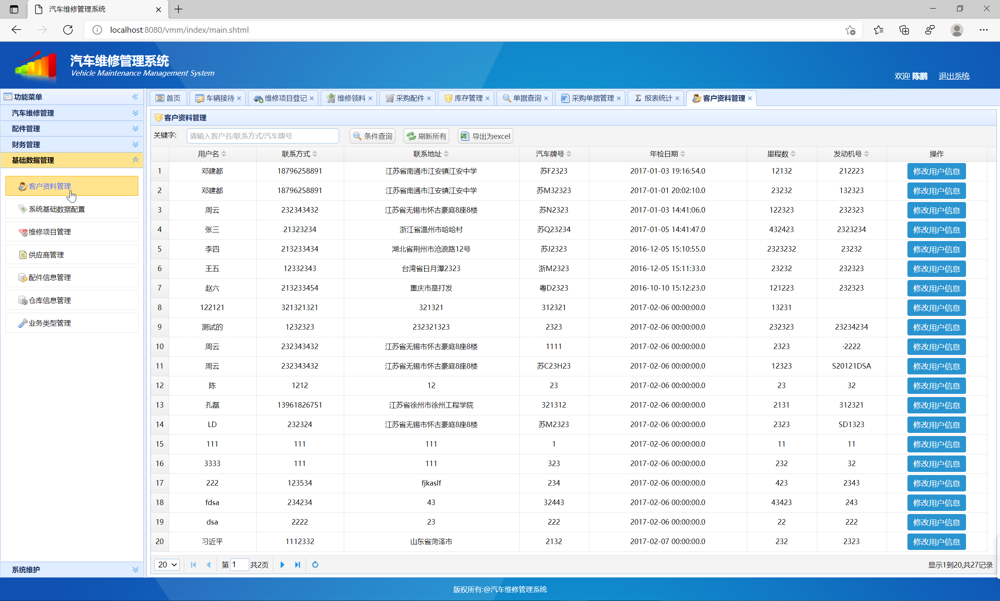
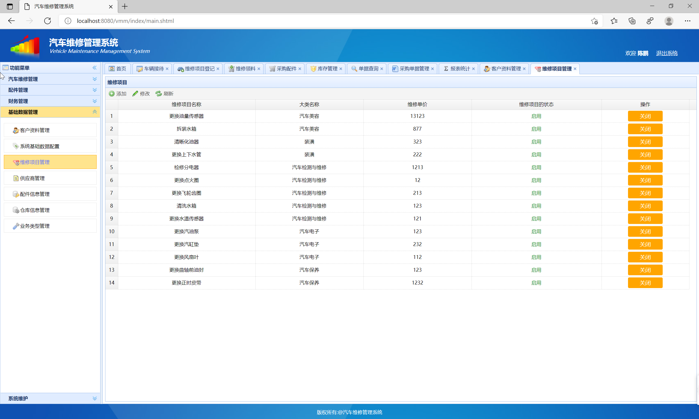
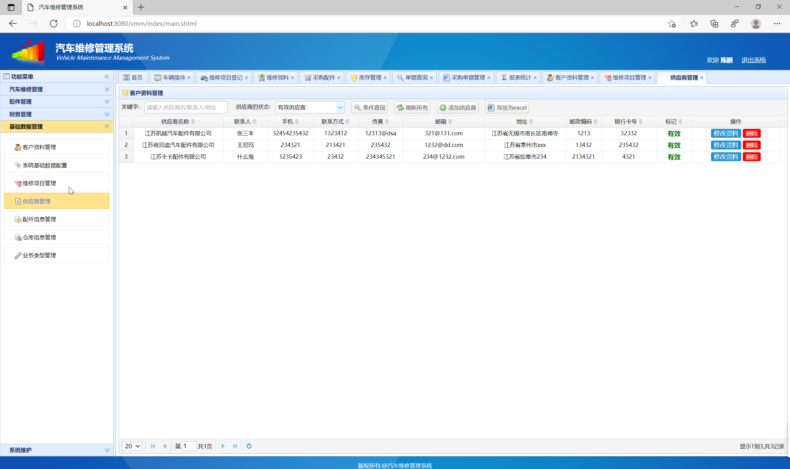

## 基于SSM框架的车辆维修管理系统

###  获取sql数据库文件: 从戎源码网 (https://armycodes.com/) QQ: 386869957 QQ群: 377586148
###  所有系统地址: (https://github.com/YuLin-Coder/AllProjectCatalog) 
###  所有项目以及源代码本人均调试运行无问题 可支持远程安装部署调试、定制修改、代码讲解

## 项目介绍
基于SSM框架的车辆维修管理系统，使用RBAC模型实现了一套动态的基于角色的权限控制, 分为多个模块
（1）车辆接待模块：维修系统开单操作，同为维修单分配维修人员和质检人员。 
（2）维修项目登记模块：维修人员登录系统能够看到自己当前所有的维修任务。 
（3）维修领料模块：根据条件查询用户维修用料登记的情况，并可以进行物料申请功能 
（4）质检完工模块 
（5）消费结算模块：车主在约定的时间进行提车，查看维修单，进行付款操作。 
（6）配件管理模块：对配件信息进行管理 
（7）基础数据管理模块：对系统的一些参数进行配置，管理系统的一些基础的数据

## 项目技术
- 编程语言：Java
- 数据库：MySQL
- 前端技术：JSP、JavaScript、bootstrap、JQuery
- 后端技术：Spring、SpringMVC、MyBatis

## 运行环境
- JDK版本：JDK1.8及以上
- 开发工具：IDEA、Ecplise、Myecplise都可以
- 数据库: MySQL5.7及以上
- Maven：maven3.0及以上

## 运行截图

